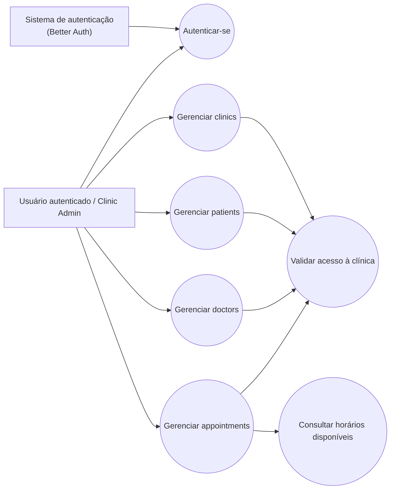

# Diagrama de Caso de Uso

## Observações

- O sistema atual é centrado no usuário autenticado da clínica; não há login separado para doctor ou patient.
- A validação de acesso à clínica aparece nos fluxos de gestão e agendamento.
