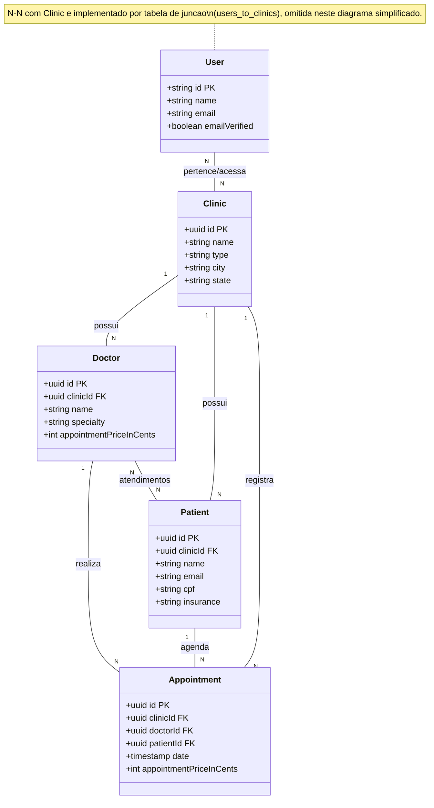

# Diagrama de Classe (Versão CRUD Principal)

Este diagrama mostra apenas as entidades principais de CRUD do sistema e suas cardinalidades.

```mermaid
classDiagram
  class User {
    +string id PK
    +string name
    +string email
    +boolean emailVerified
  }

  class Clinic {
    +uuid id PK
    +string name
    +string type
    +string city
    +string state
  }

  class Doctor {
    +uuid id PK
    +uuid clinicId FK
    +string name
    +string specialty
    +int appointmentPriceInCents
  }

  class Patient {
    +uuid id PK
    +uuid clinicId FK
    +string name
    +string email
    +string cpf
    +string insurance
  }

  class Appointment {
    +uuid id PK
    +uuid clinicId FK
    +uuid doctorId FK
    +uuid patientId FK
    +timestamp date
    +int appointmentPriceInCents
  }

  %% Cardinalidades principais
  User "N" -- "N" Clinic : pertence/acessa
  Clinic "1" -- "N" Doctor : possui
  Clinic "1" -- "N" Patient : possui
  Clinic "1" -- "N" Appointment : registra
  Doctor "1" -- "N" Appointment : realiza
  Patient "1" -- "N" Appointment : agenda

  %% Relacao derivada pelo Appointment
  Doctor "N" -- "N" Patient : atendimentos

  note for User "N-N com Clinic e implementado por tabela de juncao\n(users_to_clinics), omitida neste diagrama simplificado."
```
