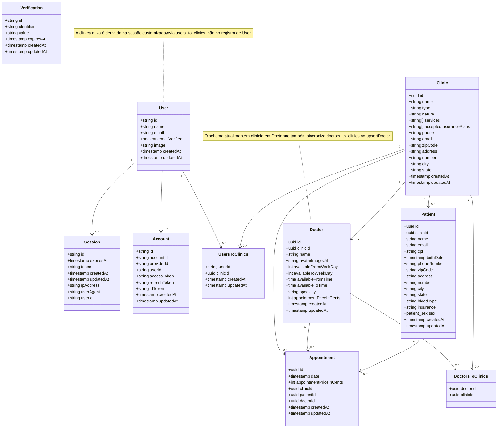

# Diagrama de Classe

## Observações

- O schema atual combina autenticacao, vinculo de usuarios a clinicas e o dominio operacional da clinica.
- O vínculo de doctor com clinic aparece em dois pontos do código: `clinicId` direto em `Doctor` e a tabela de junção `doctors_to_clinics`.
- A clínica ativa do usuário é resolvida em tempo de sessão em [src/lib/auth.ts](../src/lib/auth.ts), com base em [src/db/schema.ts](../src/db/schema.ts).
